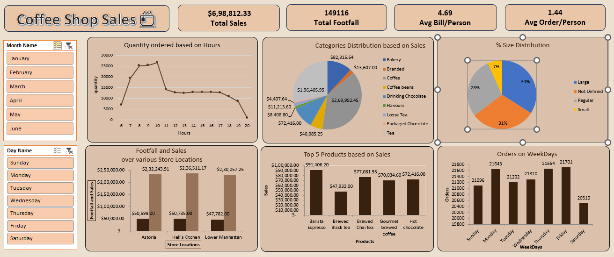

# Coffee Shop Sales Dashboard

## Overview
This project contains an interactive Excel dashboard built to analyze coffee shop sales performance across multiple dimensions including:

- Sales trends by hour
- Product category distribution
- Store location performance
- Product-level sales analysis
- Weekday order trends
- Beverage size distribution

The dashboard is designed for business intelligence and operational decision-making using Microsoft Excel.

---

# Dashboard Preview

---

# Key KPIs

| Metric | Value |
|---|---|
| Total Sales | $6,98,812.33 |
| Total Footfall | 149,116 |
| Average Bill per Person | 4.69 |
| Average Orders per Person | 1.44 |

---

# Dashboard Components

## 1. Quantity Ordered Based on Hours
Analyzes customer ordering behavior throughout the day.

### Insights
- Peak ordering hours occur between **8 AM and 10 AM**
- Significant decline observed after evening hours
- Helps optimize:
  - Staffing
  - Inventory planning
  - Operational scheduling

---

## 2. Categories Distribution Based on Sales
Displays sales contribution by product category.

### Major Categories
- Coffee
- Bakery
- Branded Products
- Loose Tea
- Drinking Chocolate
- Flavours
- Packaged Chocolate

### Insights
- Coffee contributes the highest share of total sales
- Bakery products are strong secondary revenue drivers
- Low-performing categories can be targeted for promotions

---

## 3. Size Distribution
Represents percentage distribution of order sizes.

### Categories
- Large
- Regular
- Small
- Not Defined

### Insights
- Large and Regular sizes dominate sales
- Small-size demand is comparatively low
- Useful for pricing and upselling strategy

---

## 4. Footfall and Sales Over Various Store Locations
Compares store performance across locations.

### Locations
- Astoria
- Hell's Kitchen
- Lower Manhattan

### Insights
- Hell's Kitchen generates the highest sales
- Footfall-to-sales conversion can be evaluated
- Supports location-specific business decisions

---

## 5. Top 5 Products Based on Sales
Highlights the highest revenue-generating products.

### Top Products
- Barista Espresso
- Brewed Chai Tea
- Gourmet Brewed Coffee
- Hot Chocolate
- Brewed Black Tea

### Insights
- Espresso products lead revenue generation
- Product mix optimization opportunities identified
- Enables targeted promotions and inventory prioritization

---

## 6. Orders on Weekdays
Tracks order volume distribution across weekdays.

### Insights
- Monday and Friday show higher order volumes
- Saturday records lower orders
- Useful for workforce scheduling and campaign planning

---

# Filters and Interactivity

The dashboard includes slicers for:

## Month Filter
- January
- February
- March
- April
- May
- June

## Day Filter
- Sunday through Saturday

These slicers allow dynamic filtering and interactive analysis.

---

# Business Value

This dashboard helps stakeholders:

- Monitor sales performance
- Identify peak business hours
- Analyze customer purchasing behavior
- Compare store-level performance
- Optimize staffing and inventory
- Improve product strategy

---

# Tools Used

- Microsoft Excel
  - Pivot Tables
  - Pivot Charts
  - Slicers
  - KPI Cards
  - Data Visualization

---

# Recommended Improvements

## Data Enhancements
- Add customer segmentation
- Include profitability metrics
- Add repeat customer analysis

## Dashboard Enhancements
- Add monthly trend lines
- Include YoY/MoM growth
- Add forecasting models
- Integrate automated refresh

## Operational Improvements
- Build inventory alerts
- Add staffing optimization model
- Include promotion performance tracking
